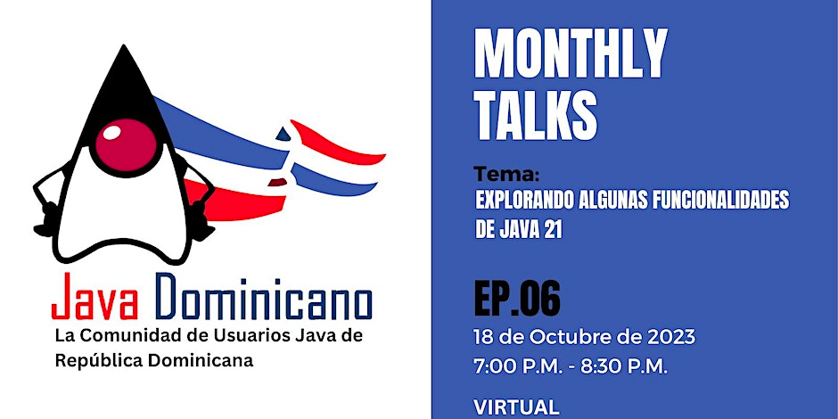

# Explorando algunas funcionalidades de Java 21

### Descargo de responsabilidad

- La información proporcionada en esta presentación tiene como objetivo educativo y se basa en la experiencia personal y
  conocimientos actuales. Si bien se ha hecho todo lo posible para garantizar la precisión y la actualidad de la
  información presentada, no se puedo garantizar su exactitud completa.
- El uso de las tecnologías mencionadas, está sujeto a los términos y condiciones de cada herramienta. Es
  responsabilidad del usuario realizar su propia investigación y cumplir con las directrices y políticas de cada
  tecnología antes de implementarlas en su entorno de producción.
- Además, cabe señalar que las mejores prácticas y las soluciones presentadas en esta charla pueden variar según los
  requisitos y las circunstancias específicas de cada proyecto. Se recomiendo encarecidamente realizar pruebas
  exhaustivas y consultar con profesionales capacitados antes de implementar cualquier solución en un entorno de
  producción.
- En resumen, mientras que esta presentación busca proporcionar información útil y práctica, el uso de las tecnologías y
  las decisiones de implementación son responsabilidad del usuario final. No se asume ninguna responsabilidad por los
  resultados derivados de la aplicación de los conceptos discutidos en esta presentación.

### Agenda

* [Introducción](#introducción)
  + `Eudris Cabrera`
  + https://bit.ly/about-eudriscabrera

* [Sequenced Collections (JEP-431)](#sequenced-collections-jep-431)
    + `Freddy Peña`
    + https://fredpena.dev
  
* [Pattern Matching (JEP-440) (Preview)](#pattern-matching-jep-440---preview)
  + `Eugenio Duran`
  + Software Engineer trabajando con Java.
  
* [Virtual Threads (JEP-444)](#virtual-threads-jep-444)
  + `Carlos Camacho`
  + Ingeniero Telemático – Profesor Universitario - Co-fundador y organizador del Java User Group en República
    Dominicana.

* [String Templates (JEP 430) (Preview)](#string-templates-jep-430---preview)
  + `Eliezer Herrera`
  + Desarrollador de software,entusiasta y amante de la tecnología, especialmente la plataforma Java.

* [Unnamed Classes and Instance Main Methods (JEP-445) (Preview)](#unnamed-classes-and-instance-main-methods-jep-445---preview)
  + `Brayan Muñoz`
  + Ingeniero Telemático – Entusiasta del código abierto.
  
#### Introducción

* ¿Cómo evoluciona Java y por qué?
* Java Playground
* ¿Qué son las funcionalidades previews y como habilitarla en tu jdk?

#### [Sequenced Collections (JEP-431)](src/main/java/org/javadominicano/jep431/README.md)

* ¿Qué necesidades abordan?
* ¿Cómo encajan en el framework de colecciones existente?
* Demostración

#### Pattern Matching (JEP-440 - Preview)

* ¿Por qué es importante para Java?
* ¿En qué consiste data-oriented programming?
* Demostración

#### Virtual Threads (JEP-444)

* ¿En qué consiste?
* ¿Cuáles problemas trata de resolver?
* ¿Qué impacto tendrá en el desarrollo de aplicaciones Java?
* Demostración

#### String Templates (JEP 430 - Preview)

* ¿En qué consiste?
* ¿Cuáles problemas trata de resolver?
* Demostración

#### Unnamed Classes and Instance Main Methods (JEP-445 - Preview)

* ¿En qué consiste?
* ¿Cuáles problemas trata de resolver?
* Demostración

## 🤝 Communidad

Unete a la comunidad de [Java Dominicana](https://linktr.ee/javadominicano)

