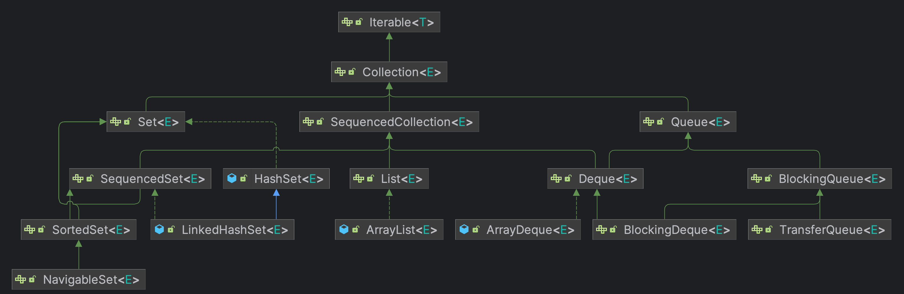
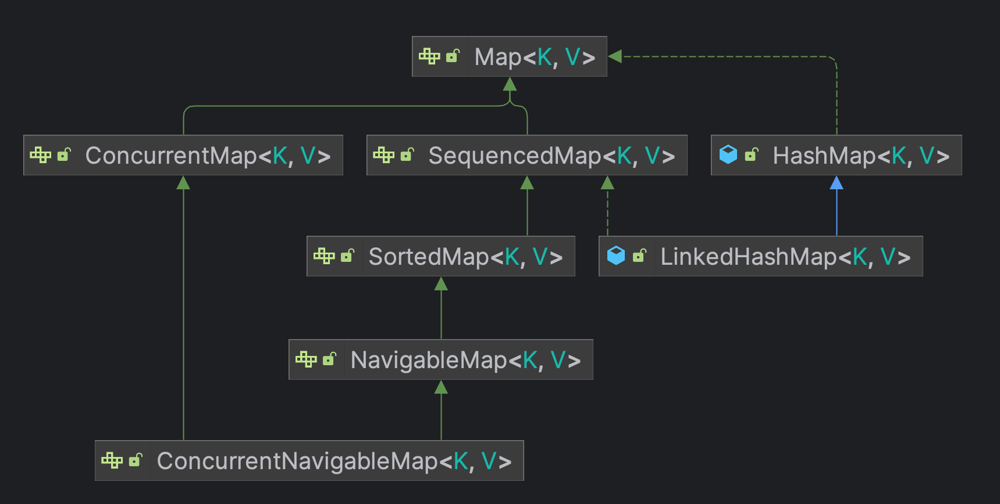

# [Sequenced Collections (JEP-431)](https://openjdk.org/jeps/431)


## SequencedCollection

La versión 21 de Java introduce la interfaz `SequenceCollection`, que se caracteriza por ser una colección con una
secuencia bien definida, que admite operaciones en ambos extremos y es reversible.

La interfaz `SequenceCollection` hereda numerosos métodos de la interfaz `Collection`, asegurando que las operaciones
mantengan el orden de encuentro. Estos métodos heredados
incluyen `iterator`, `forEach`, `parallelStream`, `spliterator`, `stream`
y `toArray`. En consecuencia, cuando interactúas con una `SequenceCollection`, puedes confiar en que estos métodos
proporcionarán los elementos en el orden prescrito.

Una de las características destacadas de `SequenceCollection` es su capacidad para agregar, recuperar y eliminar
elementos
en ambos extremos de la colección. Esta capacidad es posible gracias a nuevos métodos
como `addFirst`, `addLast`, `getFirst`, `getLast`, `removeFirsty` `removeLast`

### ¿Qué necesidades abordan?

`SequencedCollections` aborda problemas en el `Java Collections Framework`, como la falta de un supertipo común para
colecciones con orden de encuentro. Esto dificulta expresar ciertos conceptos útiles en las API. También carece de una
forma uniforme de acceder al primer y último elemento de una colección o de iterar en orden inverso. Las colecciones
secuenciadas introducen interfaces que resuelven estos problemas de manera consistente en todas las colecciones con
orden de encuentro.

### ¿Cómo encajan en el framework de colecciones existente?

Sequenced Collections introduce tres nuevas interfaces: `SequencedCollection`, `SequencedSet` y `SequencedMap`. Estas
interfaces amplían de sus respectivas interfaces (`Collection`, `Set`, y `Map`) y proporcionan métodos adicionales para acceder y
manipular sus elementos según su orden de encuentro.


`SequencedCollections and SequencedSet Interfaces and some implementations `

```java
interface SequencedCollection<E> extends Collection<E> {

    // new method
    SequencedCollection<E> reversed();

    // methods promoted from Deque
    default void addFirst(E);

    default void addLast(E);

    default E getFirst();

    default E getLast();

    default E removeFirst();

    default E removeLast();

}
```

Por ejemplo, el siguiente programa crea un `ArrayList` y realiza algunas operaciones básica en él:

```java
public class Demo {
    public static void main(String[] args) {

        List<Integer> list = new ArrayList<>();
        list.add(2014);                         // Adds 2014 to the list.
        list.addFirst(1996);                    // Adds 1996 to the beginning of the list.
        //list.add(0, 1996);                    // Before java 21
        list.addLast(2023);                     // Adds 2023 to the end of the list.
        //list.add(2023);                       // Before java 21
        System.out.println(list);               // Output: [1996, 2014, 2023]
        System.out.println(list.getFirst());    // Output: 1996
        System.out.println(list.getLast());     // Output: 2023
        System.out.println(list.reversed());    // Output: [2023, 2014, 1996]
        System.out.println(list.removeFirst()); // Output: 1996
        //list.remove(0);                       // Before java 21
        System.out.println(list.removeLast());  // Output: 2023
        //list.remove(list.size() - 1);         // Before java 21
        System.out.println(list);               // Output: [2014]

    }
}
```

El método `reversed`, como se muestra en el código anterior, proporciona una vista en orden inverso de
`SequenceCollection`. En esta visión invertida, los conceptos de primero y último están invertidos, al igual que los
conceptos de sucesor y predecesor.

## SequencedSet

```java
interface SequencedSet<E> extends Set<E>, SequencedCollection<E> {

    @Override
    SequencedSet<E> reversed();

}
```

Por ejemplo, el siguiente programa crea un `LinkedHashSet` y realiza algunas operaciones básica en él:

```java
public class Demo {
    public static void main(String[] args) {

        LinkedHashSet<Integer> hashSet = new LinkedHashSet<>(Set.of(1996, 2014, 2018, 2021, 2023));
        System.out.println("Contents: " + hashSet);                 // Output: [2018, 1996, 2014, 2023, 2021]
        System.out.println("First element: " + hashSet.getFirst()); // Output: 2018
        System.out.println("Last element: " + hashSet.getLast());   // Output: 2021
        System.out.println("Reversed view: " + hashSet.reversed()); // Output: [2021, 2023, 2014, 1996, 2018]

    }
}
```

La interfaces `SequenceCollection` y `SequencedSet` nos ofrecen varios beneficios, tales como:

- _Control mejorado_
- _Orden de encuentro consistente_
- _Reversibilidad_
- _Compatibilidad_

## SequencedMap

La interfaz `SequencedMap` es específica de implementaciones de mapas como `LinkedHashMap`. `SequencedMap`
extiende `Map` y proporciona métodos para acceder y manipular sus entradas según su orden de encuentro.



```java
interface SequencedMap<K, V> extends Map<K, V> {

    // new methods
    SequencedMap<K, V> reversed(); //Provides a reversed view of the map.

    default SequencedSet<Map.Entry<K, V>> sequencedEntrySet(); //Returns a SequencedSet of map entries, maintaining the encounter order.

    default SequencedCollection<V> sequencedValues(); //Returns a SequencedCollection of map values, preserving the encounter order.

    default SequencedSet<K> sequencedKeySet(); //Returns a SequencedSet of map keys, reflecting the encounter order.

    default V putFirst(K k, V v); //Inserts an entry at the beginning of the map.

    default V putLast(K k, V v); //Inserts an entry at the end of the map.

    // methods promoted from NavigableMap
    default Map.Entry<K, V> firstEntry(); //Retrieves the first entry in the map.

    default Map.Entry<K, V> lastEntry(); //Retrieves the last entry in the map.

    default Map.Entry<K, V> pollFirstEntry(); //Removes and returns the first entry in the map.

    default Map.Entry<K, V> pollLastEntry(); //Removes and returns the last entry in the map.

}

```

Como podemos ver, todos los métodos excepto `reversed()` son métodos predeterminados y proporcionan una implementación
predeterminada. Esto significa que las clases de mapas existentes, como LinkedHashMap, pueden implementar esta interfaz
sin cambiar su código.

Por ejemplo, el siguiente programa crea un `LinkedHashMap` y realiza algunas operaciones básica en él

```java
public class Demo {
    public static void main(String[] args) {

        LinkedHashMap<Integer, String> hashMap = new LinkedHashMap<>();
        hashMap.put(2014, "1.8");
        hashMap.put(2018, "11");
        hashMap.put(2021, "17");
        hashMap.put(2023, "21");

        System.out.println("HashMap: " + hashMap);
        // Output: {2014=1.8, 2018=11, 2021=17, 2023=21}

        hashMap.putFirst(1996, "1.0");
        hashMap.putLast(2024, "22");

        System.out.println("HashMap: " + hashMap);
        // Output: {1996=1.0, 2014=1.8, 2018=11, 2021=17, 2023=21, 2024=22}

        System.out.println("Fetching first entry: " + hashMap.firstEntry());
        // Output: 2024=22

        System.out.println("Fetching last entry: " + hashMap.lastEntry());
        // Output: 2024=22

        System.out.println("Removing first entry: " + hashMap.pollFirstEntry());
        // Output: 1996=1.0

        System.out.println("Removing last entry: " + hashMap.pollLastEntry());
        // Output: 2024=22

        System.out.println("HashMap: " + hashMap);
        // Output: {2014=1.8, 2018=11, 2021=17, 2023=21}

        System.out.println("Reversed view of the map: " + hashMap.reversed());
        // Output: {2023=21, 2021=17, 2018=11, 2014=1.8}

    }
}
```