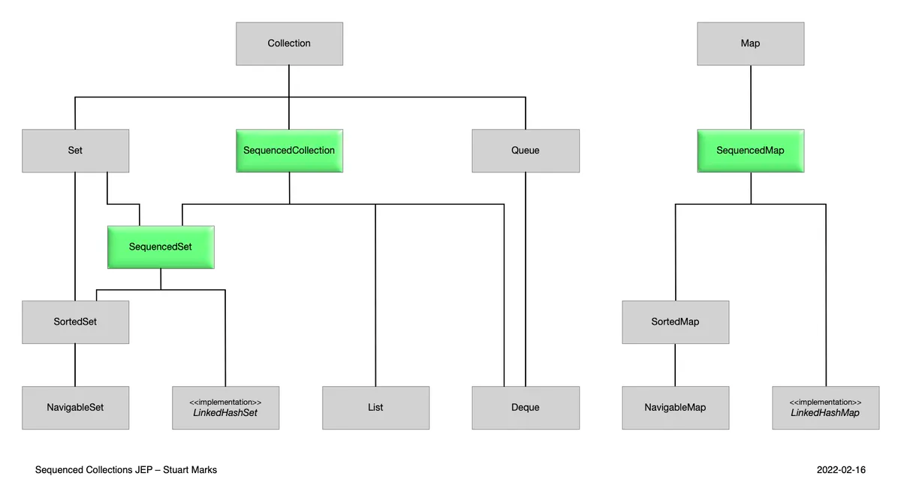

# Sequenced Collections (JEP-431)



## Antes de Sequenced Collections
```
                        First element	                        Last element
List	                list.get(0)	                        list.get(list.size() - 1)
Deque	                deque.getFirst()	                deque.getLast()
SortedSet	        sortedSet.first()	                sortedSet.last()
LinkedHashSet   	linkedHashSet.iterator().next()	        // missing
```

## SequencedCollection

```
interface SequencedCollection<E> extends Collection<E> {

    // new method
    SequencedCollection<E> reversed();

    // methods promoted from Deque
    default void addFirst(E);
    default void addLast(E);

    default E getFirst();
    default E getLast();

    default E removeFirst();
    default E removeLast();
}
```

Por ejemplo, el siguiente programa crea un ArrayList y realiza algunas operaciones secuenciadas básica en él:

```
SequencedCollection<Integer> arrayList = new ArrayList<>();
arrayList.add(2014); // [2014]
arrayList.addFirst(1996); // [1996, 2014]
arrayList.addLast(2023); // [1996, 2014, 2023]
arrayList.getFirst(); // 1996
arrayList.getLast(); // 2023
arrayList.reversed(); // [2023, 2014, 1996]
```

Tenga en cuenta que cualquier modificación de la lista es visible en todos los métodos, incluida la vista invertida:

```
arrayList.add(2025); // [1996, 2014, 2023, 2025]
arrayList.reversed(); // [2025, 2023, 2014, 1996]
```

## SequencedSet

```
interface SequencedSet<E> extends Set<E>, SequencedCollection<E> {

    @Override
    SequencedSet<E> reversed();;
}
```

Por ejemplo, el siguiente programa crea un LinkedHashSet y realiza algunas operaciones secuenciadas básica en él:
```
LinkedHashSet<Integer> linkedHashSet = new LinkedHashSet<>();
linkedHashSet.add(2014); // [2014]
linkedHashSet.addFirst(1996); // [1996, 2014]
linkedHashSet.addLast(2023); // [1996, 2014, 2023]
linkedHashSet.getFirst(); // 1996
linkedHashSet.getLast(); // 2023
linkedHashSet.reversed(); // [2023, 2014, 1996]
```

Tenga en cuenta que cualquier modificación de la lista es visible en todos los métodos, incluida la vista invertida:

```
linkedHashSet.add(2025); // [1996, 2014, 2023, 2025]
linkedHashSet.reversed(); // [2025, 2023, 2014, 1996]
```

## SequencedMap

```
interface SequencedMap<K, V> extends Map<K, V> {
    
    // new methods
    SequencedMap<K, V> reversed();
    default SequencedSet<Map.Entry<K, V>> sequencedEntrySet();
    default SequencedCollection<V> sequencedValues();
    default SequencedSet<K> sequencedKeySet();

    default V putFirst(K k, V v);
    default V putLast(K k, V v);

    // methods promoted from NavigableMap
    default Map.Entry<K,V> firstEntry();
    default Map.Entry<K,V> lastEntry();
    default Map.Entry<K,V> pollFirstEntry();
    default Map.Entry<K,V> pollLastEntry();
}

```

Por ejemplo, el siguiente programa crea un LinkedHashMap y realiza algunas operaciones secuenciadas básica en él
```
LinkedHashMap<Integer,String> linkedHashMap = new LinkedHashMap<>();
linkedHashMap.put(2014,"1.8"); // [{2014=1.8}]
linkedHashMap.putFirst(1996,"1.0"); // [{1996=1.0, 2014=1.8}]
linkedHashMap.putLast(2023,"21"); // [{1996=1.0, 2014=1.8, 2023=21}]
linkedHashMap.firstEntry(); // [1996=1.0]
linkedHashMap.lastEntry(); // [2023=21]
linkedHashMap.reversed(); // [{2023=21, 2014=1.8, 1996=1.0}]
```