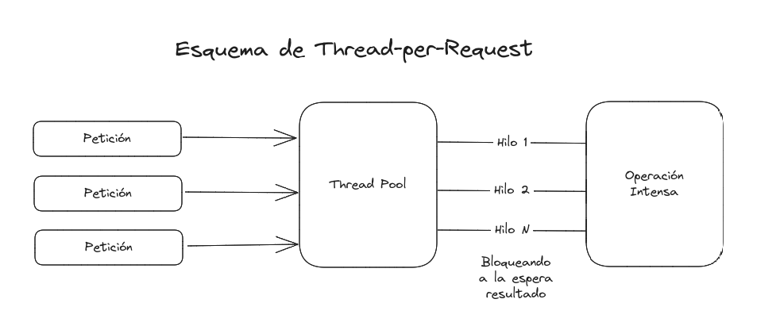
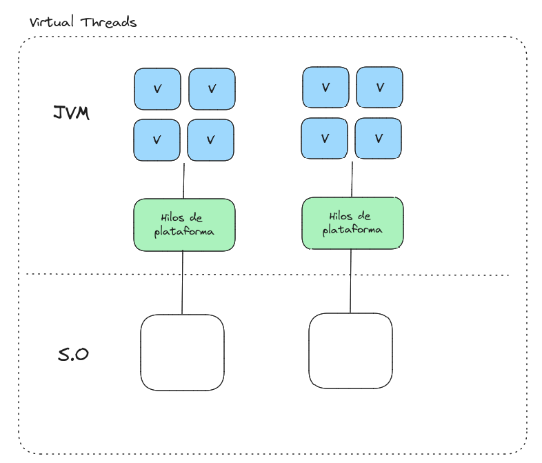

# Virtual Threads - JPE 444

## Contexto

Actualmente los hilos de plataforma tiene una relación directa con los hilos del sistema operativo. Los Thread son envoltorio de un proceso del sistema operativo. Manejar procesos del S.O tiene un costo en recursos que en escenarios de alta concurrencia y utilizando el esquema de un Hilo por Petición (Thread per Request) se evidencia ese costo en el manejo de los recursos, dado que una transacción es igual a un subproceso en el software y a su vez en el S.O.

El costo de crear un hilo del sistema operativo, se debe almacenar en el stack de memoria y se reselvan unos 20 Mb por adelantado, como es un proceso gestionado por el S.O demora aproximadamente uno milisegundo para iniciar el hilo conforme se incrementan las solictudes de subprocesos se demandan más memoria consumiendo una cantidad considerable de recursos.

## ¿Qué son los Virtual Thread?

Nos permite trabajar con subprocesos al igual que los procesos de plataforma pero sin la vinculación 1:1 con los hilos del sistema operativo. Los hilos virtuales se implementan de manera similar a la memoria virtual. Para simular una gran cantidad de memoria, un sistema operativo asigna un gran espacio de direcciones virtuales a una cantidad limitada de RAM. De manera similar, para simular una gran cantidad de subprocesos, el tiempo de ejecución de Java asigna una gran cantidad de subprocesos virtuales a una pequeña cantidad de subprocesos del sistema operativo.

Los Virtual Thread tiene como objetivo primario poder garantizar un escalado de los recursos de forma correcta donde no dependan directamente de los hilos del sistema operativo, utilizando el Java HEAP para la coordinación de los procesos en memoria.

## ¿Cuáles son sus objetivos?

- Permitir que las aplicaciones servidor bajo el esquema Thread-per-request pueden escalar de forma optima.
- Implementar los hilos virtuales con cambios minimos en la clase java.lang.Thread.
- Los hilos virtuales puedan ejecutarse sobre cualquiercódigo existente basado en hilos.
- Conseguir que el manejo de los hilos no tengan ese costo de creación con respecto a los hilos de plataforma, se logra un rendimiento 1000 más eficientes.
- Seguir utilizadando todas las herramientas disponibles del JDK para los procesos de troubleshooting, debugging y profiling de los hilos virtuales.

## ¿Cuáles no son sus objetivos?

- No busca eliminar la implementación tradicional de los subprocesos de plataforma ni una migración silencioa.
- No busca cambiar el modelo de concurrencia básico en Java.
- No tiene como objetivo cambiar el API actual de paralelismo, el Stream API sigue siendo la forma preferida para el procesamiento de grandes conjuntos de datos en paralelo.

## ¿Cuáles son beneficios?

- **Mayor eficiencia en el uso de recursos:** Los virtual threads son mucho más livianos en términos de memoria y CPU que los hilos tradicionales de Java. Esto significa que se pueden ejecutar muchos más virtual threads concurrentemente sin agotar los recursos del sistema, lo que resulta en un menor consumo de energía y un mejor rendimiento en general.

- **Mayor escalabilidad:** Al ser mucho más livianos, los virtual threads permiten una mayor escalabilidad en la programación concurrente. Esto significa que se pueden crear y administrar más hilos al mismo tiempo sin tener un impacto significativo en el rendimiento del sistema.

- **Mayor simplicidad en la programación:** Los virtual threads se ejecutan en un nivel más alto de abstracción que los hilos tradicionales, lo que significa que se puede utilizar una sintaxis más simple y legible para la programación concurrente. Esto hace que sea más fácil y rápido desarrollar aplicaciones que utilizan concurrencia.

- **Mejor rendimiento en aplicaciones con muchas operaciones de E/S:** Los virtual threads están diseñados específicamente para mejorar el rendimiento de operaciones de entrada/salida, como leer o escribir en archivos o realizar conexiones de red. Al utilizar virtual threads en lugar de hilos tradicionales, se pueden realizar muchas más operaciones de E/S en paralelo, lo que resulta en un mejor rendimiento y tiempo de respuesta en aplicaciones que dependen en gran medida de estas operaciones.

## ¿Debemos olvidarnos de los hilos de plataforma?

No, los hilos virtuales son ideal para procesos que estarán mucho tiempo bloqueados en la mayoría del tiempo esperando 
completar procesos de E/S. Para operaciones que requieran un largo tiempo de ejecución y uso intensivo del CPU es 
recomendable el uso de los hilos de plataforma.